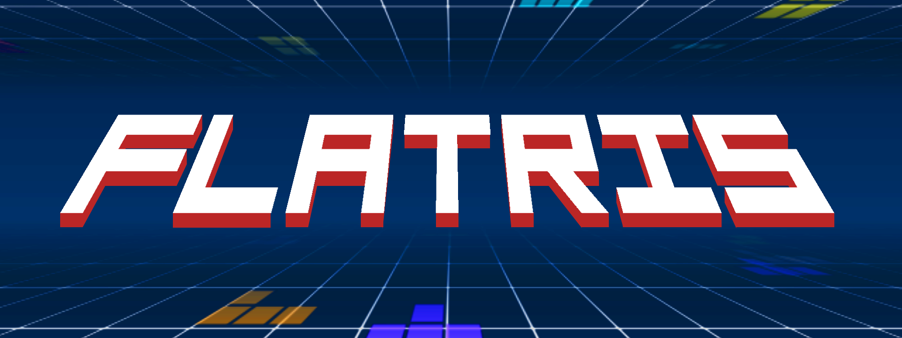

# Flatris

  

**​Created for Block Falling Game Jam 2025.**

So this is yet another tetris clone. But this time pieces fall not from the top of the game field, but they fall **onto** game field. To put it simply this is 3D tetris but better implemented.

***Download it here:*** https://unfavorable-enhancer.itch.io/flatris

## Features:

- 3 Game modes to enjoy:
    1. Marathon Mode - Survive as long as you can with increasing speeds on each level!
    2. Time Attack Mode - Clear 40 lines as fast as you can!
    3. Cheese mode - There's too much cheese on the game field. Erase as much layers of randomized cheese as you can!
- 5 Rulesets to use for each gamemode:
    1. Standard - No gimmicks, the most basic gameplay
    2. Hard - Field is way smaller and you have no chances for mistakes!
    3. Extreme - ~~basically block blast but its normal block stacking puzzle game~~
    4. ​Reversi - Each 20 pieces whole game field reverses!
    5. Zone - Lines doesn't erase instantly. You have some time to build giant combos!
- You can also customize the game as you want _and turn on all gimmicks at once._
- Online leaderboards to compete with others in each of gamemode + ruleset combinations!
- 3 Unique selectable backgrounds each taking its own place and having banger music!

## Credits:

- unfavorable_enhancer - Game design, Programming, Visual design, SFX, ​Animation.
- W3Rn1ckz - Music.
- debslow - Background themes graphics.

## Build

This project was built with Godot Engine 4.5.stable.
No other dependencies required, just import and use it as you wish.

However this project uses Talo as online leaderboards backend and API key is not provided within the repository, So source code version wont have online leaderboards working.

## License
Flatris is MIT licensed project. You can read license in "LICENSE".

Fonts and addons are covered by different licenses. You can check them in respective folders.

All original images, sound effects and their avaiable assets are under [CC BY 4.0](https://creativecommons.org/licenses/by-nc/4.0/legalcode.txt) license.
Rights to assets made by team members belongs to them.

Flatris © 2025 by unvaforable_enhancer

